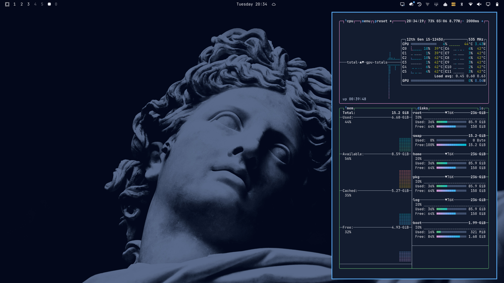

# Legibilis

A dark [Omarchy](https://omarchy.org) theme built for readability; *legibilis* is Latin for "readable".
It is based on the Modus Vivendi Tinted palette, on a cobalt background, with every color at 7:1 contrast or more (WCAG AAA) and colors kept distinguishable for color-blind viewers.
The backgrounds are classical marble sculptures toned to the palette.



## Install

```bash
omarchy theme install https://github.com/katabex/omarchy-legibilis-theme
```

## Extras

- `emacs/legibilis-theme.el`: an Emacs theme derived from Modus Vivendi Tinted, held to the same 7:1 standard.
- `freetube-theme.css` and `freetube-inject.js`: a FreeTube stylesheet in the same palette.

## Credits

- Palette: [Modus themes](https://github.com/protesilaos/modus-themes) by Protesilaos Stavrou (GNU GPL-3.0-or-later).
- Backgrounds: a photograph of the head of the *Apollo Belvedere* and a black-and-white photograph of Michelangelo's *David* (detail), both downloaded as wallpapers; the sculptures are in the public domain, but the photographs' sources and rights are unknown.
  The theme's versions are cropped, resized and toned to the palette.

## License

Copyright (C) 2026 Katabex.

The theme files (the Omarchy palette, the Emacs theme and the FreeTube stylesheet) are licensed under the [GNU General Public License v3.0 or later](LICENSE), as the Emacs theme is derived from the GPL-licensed Modus themes.
The background images are not covered by this license; each keeps the terms of its source photograph, listed under Credits.
